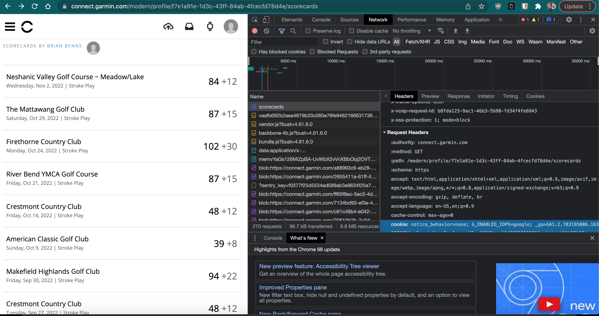
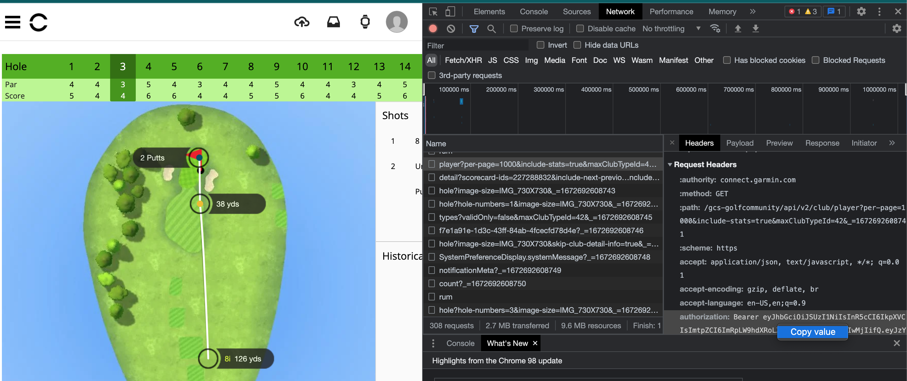

# garmin-export

This repository is a guide and scripts meant to help golfers export and transform their Garmin shot data. This was tested with a Garmin S60 watch though I imagine it would work with any watch in the Approach series that captures shot data. 

The prerequisites for this process is that you must have a Garmin Connect account and be comfortable running a Python script from the command line. 

### Login

First login to https://connect.garmin.com/ in your browser.

### Get Cookie and Authorization Headers

Navigate to the scorecards page of the website. Open up [developer tools](https://www.geeksforgeeks.org/browser-developer-tools/) of your browser and navigate to the network tab. You may need to reload the page to populate this view. 

What we need to do is copy the cookie that your browser set when you logged in. I was able to get this by clicking on the first entry in the network tab, which was just an html document called "scorecards" and then navigating in the headers section until I found the cookie in the Request Headers section. Right click to copy that value. 

Open up the `getshots.py` script and paste the cookie value from your clipboard to the cookie variable at the top of the script. 

Optional: If you want club names in your output, then we need an addional header. Navigate to a specific scorecard and then click on a hole to bring up the shot map. We're looking for a network request like `player?per-page=1000...` in the developer tools. If you find and click that request, then you want to copy the request header called `Authorization` and paste that into the script as well for the variable labeled authorization. If you don't do this, or if you didn't select the club used on the course, clubs will just be labeled "unknown."  

Note: These values contain a token that is essentially a temporary password to your Garmin account. Don't share the values without understanding the privacy concerns.

### Run the script

Run the script from the command line like `python getshots.py`. This will output a CSV file in the current directory. Each run will export all shots you have recorded with Garmin so it could take a while. 

### The Data

All distances are in yards.

| Field | Explanation |
| :----- | :----------- |
| club | The name of the club used for the shot |
| hole_num | The hole number on the course |
| shot_num | Shot number within the hole |
| start_dis_to_pin | Distance to the pin before the shot |
| start_lie | The lie type for the shot |
| end_dis_to_pin | The distance to the pin at the end of the shot |
| end_lie | The lie at the end of the shot |
| shot_dis | Total distance of the shot | 
| shot_type | The type of the shot, determined by Garmin. | 
| end_x | Used by Garmin to plot the shot on the image map |
| end_y | Used by Garmin to plot the shot on the image map |
| score | Score on the hole
| scorecard_url| URL of the scorecard for reference |